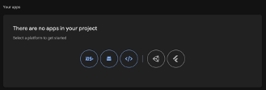
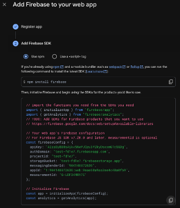
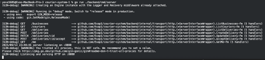
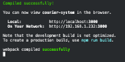

## **Courier Management User Guide**

### **1. Prerequisites**

**Node.js and npm**: To run the React frontend, make sure you have
Node.js and npm installed.

**Go**: To run the backend server, make sure you have Go installed.

**Firebase**:

-   You will need a *Firebase project with Authentication*
    (Email/Password and Google sign and Firestore database.)\
    You can create one on <https://console.firebase.google.com/>.
    This project's Firebase config keys will be used in the frontend (see more in
    step 3).

-   You'll also need to generate a *Firebase Service Account
    JSON* file for server authentication. You
    can do this by going to:
    Project settings → Service accounts → Select go → Generate new
    private key and saving the JSON file.
    Place this JSON file somewhere accessible and secret (but do NOT
    commit it to git). (see more in step 3, used for FIREBASE_SA )

**Google Maps API Key**: Enable "Maps JavaScript API" and "Places API"
in Google Cloud (<https://console.cloud.google.com/>) and obtain an API
key. You can do this by going to: APIs & Services → Credentials → Create
credentials → API key. This is required for address autocomplete and map
display (see more in step 3).

### **2. Cloning the Repository**

Begin by cloning the project repository from GitHub:
```
git clone https://github.com/Evap1/courier-system.git
```

Then, navigate into the project directory:
```
cd courier-system
```

The repository contains both frontend and backend code.

### **3. Configuration**

Before running the app, you need to configure environment variables for
the frontend and backend:

**Frontend**:
In the project root, you can find a file named ".env". This file holds
the Firebase and Google Maps keys. Open it and ensure it contains the
following keys (replace the placeholder values with your actual
credentials):
```
REACT_APP_FIREBASE_API_KEY=\<Your Firebase Web API Key\>

REACT_APP_FIREBASE_AUTH_DOMAIN=\<your-project-id\>.firebaseapp.com

REACT_APP_FIREBASE_PROJECT_ID=\<your-project-id\>

REACT_APP_FIREBASE_STORAGE_BUCKET=\<your-project-id\>.appspot.com

REACT_APP_FIREBASE_MESSAGING_SENDER_ID=\<Firebase Sender ID\>

REACT_APP_FIREBASE_APP_ID=\<Firebase App ID\>

REACT_APP_GOOGLE_MAPS_API_KEY=\<Your Google Maps API Key\>
```
The Firebase values can be found in your Firebase project settings under
Project Settings → General → SDK setup and configuration :



Choose the web and follow the instructions.\
All of the required fields will be filled out in this screen:\


The Google Maps API key can be found in your Google Cloud account
settings under: APIs & Services → Credentials → Show key.\
\
**Backend**:\
The backend expects two environment variables at runtime:

-   GCP_PROJECT_ID - Your Google Cloud project ID (the same as Firebase
    project ID).

-   FIREBASE_SA - The file path to your Firebase Service Account JSON
    credentials, that is kept in a secret and a local location

You can create a backend specific .env file or include it in the same
root .env file. Alternatively, you can export these variables in your
shell before running the server.

**IMPORTANT:** Never expose your service account JSON or API keys in a
public repo. Keep the .env out of version control.

### **4. Installation**

Install dependencies for the **frontend**:\
```
npm install
```

This will download all required packages listed in package.json.

For the **backend**:
```
go mod download
```
This will fetch Go dependencies (Gin, Firebase Admin SDK, etc.).

### **5. Running the Backend Server**

Start the backend API server first, from the project root:
```
source .env
go run .\backend\cmd\server
```

This will compile and run the Go server. If your env vars are set, you
should see a log like "server\
listening on :8080" in the console. The server will connect to Firestore
and be ready to accept requests, Leave this running.



### **6. Running the Frontend App**

In another terminal, from the project root, start the React development
server:
```
npm start
```

This will start the app on **http://localhost:3000** (the default server
address) and usually will open your default browser with that URL.



### **7. Using the Application**

With both servers running, you can now use the app:
Open http://localhost:3000 in your browser, you should see the Login
page.

Sign In as a new user and choose your role.

**For Business account:**

create a new account, then on the first screen choose "Business" and
enter a business name and address. Now you will see the business
dashboard. Try adding a new delivery, it should appear in your list with
status "posted" and "Unassigned". When the courier picks it up, the
status will be changed to "picked_up". At that point, an "Open Map"
button should appear in the Courier Info column. Click on it to watch
the courier moving on the map in real time. When delivered, the status
will be changed to "delivered" .

**For courier account:**

create a new account, then on the first screen choose "Courier" and
enter a name. Allow location access (in browser prompt) to enable live
tracking. You should see a map and posted deliveries as markers on it.
Click on one to accept it, update the status to "Picked Up" by clicking
on it again when picked. Then, navigate to the destination and update
the status to "Delivered" when the drop off was successful.

**For Admin account:**

There's no UI to register as admin.\
In the root folder, there is a folder called "scripts" and a file called
initAdmin.js in it.\
This file initializes an admin user or updates an existing one.\
When admin is initialized, you may sign in with email and password and
with google sign in as well.\
When data is seeded you may see all dashboards functionality.

*To run initAdmin.js:*

0\. If it's the first time running the script: run 
```
npm i firebase-admin \@faker-js/faker uuid\
```
1\. make sure you're in the root.

2\. Modify ADMIN_EMAIL and ADMIN_PASSWORD in initAdmin.js as desired.

3\. Run the following, can be found in env file:
```
export FIREBASE_SA=\<\>
export GCP_PROJECT_ID=\<\>
```
4\. Run the file: node /scripts/initAdmin.js

**To fill dummy data:**

*If you desire to test API:*\
You may manually create deliveries and users using the app
or use postman to execute API functions

*If you desire to only fill the data:*\
You may manually add users and deliveries in firebase
console database in the collection created.
or you may **run scripts/seed.js** file that will do the previous,
automatically.\

*Important to emphasize*, it will creae users and
deliveries directly in firebase DB, thus it's not testing the API
functionality (for delivery creation perhaps).

*To run seed.js:*

0\. If it's the first time running the script, run 
```
npm i firebase-admin \@faker-js/faker uuid\
```
1\. make sure you're in the root.

2\. Modify SEED_PASSWORD in seed.js as desired.

3\. Run the following, can be found in env file:

```
export FIREBASE_SA=\<\>
export GCP_PROJECT_ID=\<\>
```

4\. Run the file: node /scripts/seed.js
